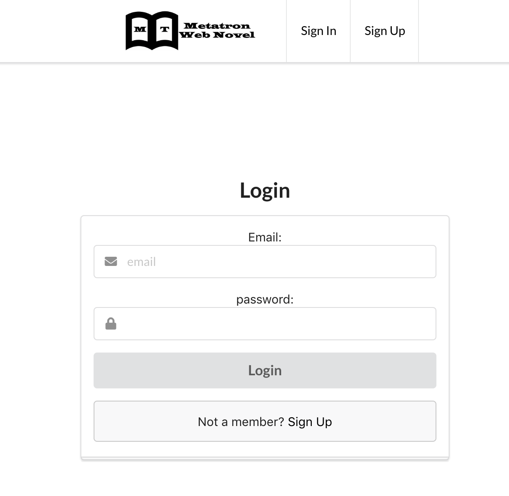
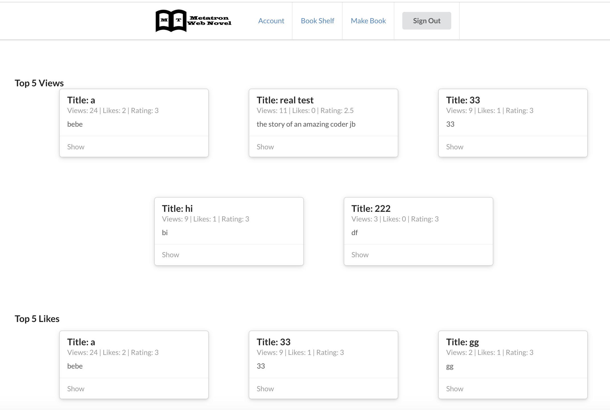
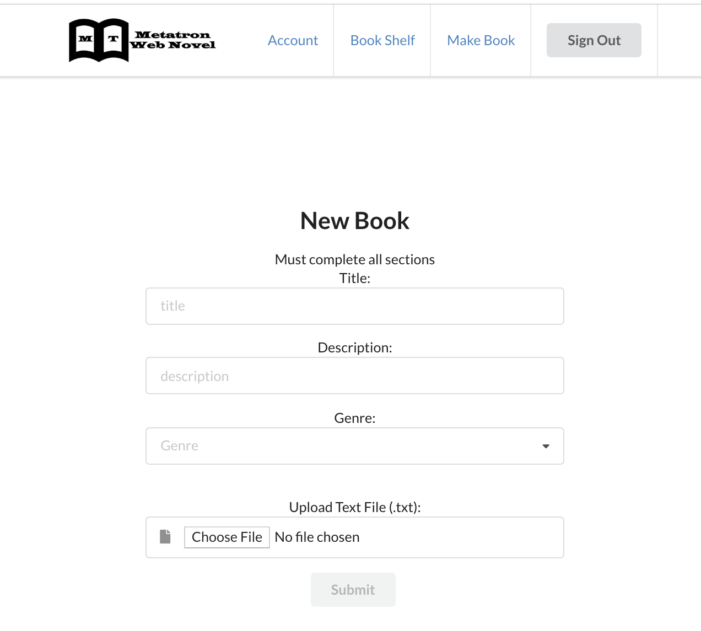
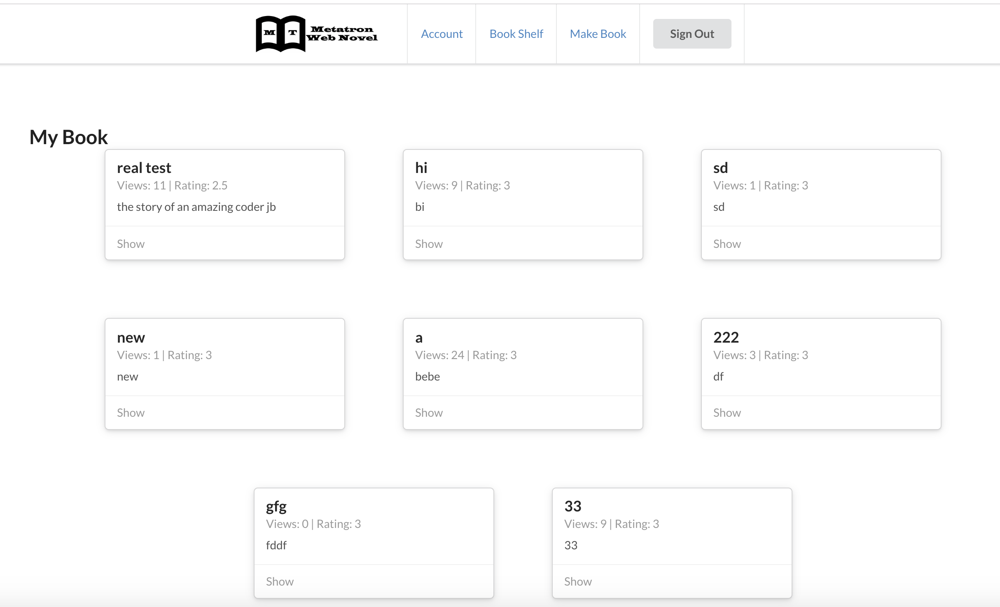
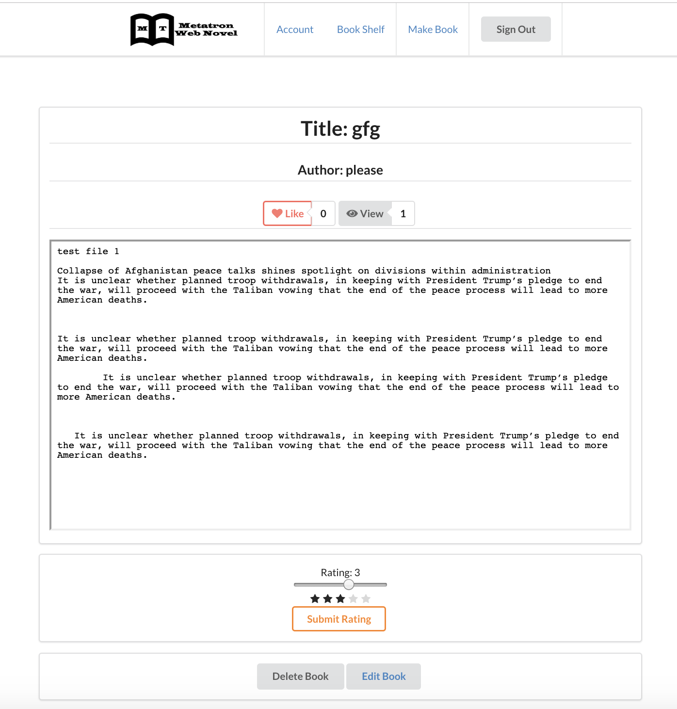

#Tindawg

## Intro

### Website URL

[Metatron](https://metatron-c9885.firebaseapp.com/bookshelf/taKwXBZy9ARHnKTAK2ARbChIjsp2) 

### Motivation

This project is a full-stack development project of Jungbin Oh. Metatron is a web novel platform for authors who want to share their work online. Users can upload their work and receive likes and ratings by other users.

### Built With

- HTML5
- CSS3
- JavaScript
- React
- Firebase
- Semantic UI React

## Wireframe

### Sign In & Sign Up

Users can create their account to use the service.

### Home

The home page displays the novels with top 5 views and top 5 likes.

### Make Book

The user can upload their writing by uploading .txt file. The user can add information about their books such as title, description, and genre.

### Bookshelf

The bookshelf displays the books that the user has uploaded and books that they liked.

### Show Book 

The user can read, like, and rate the material. If the user owns that book, he/she can edit or delete the book.

